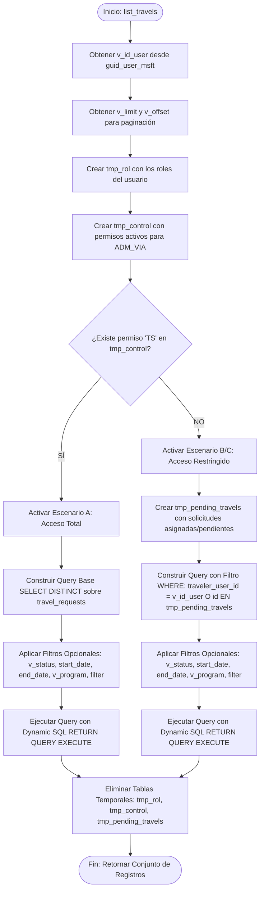

```mermaid
flowchart TD
    Start([Inicio: list_travels]) --> P1[Obtener v_id_user desde guid_user_msft]
    P1 --> P2[Obtener v_limit y v_offset para paginación]
    
    P2 --> T1[Crear tmp_rol con los roles del usuario]
    T1 --> T2[Crear tmp_control con permisos activos para ADM_VIA]
    
    T2 --> C1{¿Existe permiso 'TS' en tmp_control?}
    
    %% ESCENARIO A: ADMINISTRADOR / SUPERVISOR
    C1 -- SÍ --> Admin[Activar Escenario A: Acceso Total]
    Admin --> Q1[Construir Query Base SELECT DISTINCT sobre travel_requests]
    Q1 --> Filter1[Aplicar Filtros Opcionales: v_status, start_date, end_date, v_program, filter]
    Filter1 --> Exec1[Ejecutar Query con Dynamic SQL RETURN QUERY EXECUTE]
    
    %% ESCENARIO B/C: SOLICITANTE / APROBADOR
    C1 -- NO --> NonAdmin[Activar Escenario B/C: Acceso Restringido]
    NonAdmin --> T3[Crear tmp_pending_travels con solicitudes asignadas/pendientes]
    T3 --> Q2[Construir Query con Filtro WHERE: traveler_user_id = v_id_user O id EN tmp_pending_travels]
    Q2 --> Filter2[Aplicar Filtros Opcionales: v_status, start_date, end_date, v_program, filter]
    Filter2 --> Exec2[Ejecutar Query con Dynamic SQL RETURN QUERY EXECUTE]
    
    %% FINALIZACIÓN
    Exec1 --> DropTables[Eliminar Tablas Temporales: tmp_rol, tmp_control, tmp_pending_travels]
    Exec2 --> DropTables
    
    DropTables --> End([Fin: Retornar Conjunto de Registros])
```